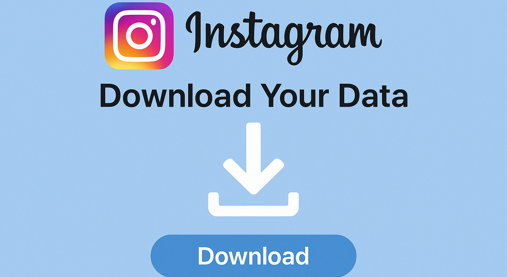

# instagram-data-download

A lightweight automation toolkit to fetch and archive your complete Instagram account data — posts, messages, stories, insights, and more. Perfect for users, creators, and businesses wanting data control or backups.

<p align="center">
  <a href="https://t.me/devpilot1" target="_blank">
    
  </a>
  <a href="https://discord.gg/vBu9huKBvy" target="_blank">
    
  </a>
  <a href="https://wa.me/447723343390?text=Hi%20Zeeshan%2C%20I%27m%20interested%20in%20automation." target="_blank">
    
  </a>
  <a href="mailto:support@appilot.app" target="_blank">
    
  </a>
</p>

<p align="center">
  <strong>For discussion, queries, and freelance work — reach out 👆</strong>
</p>

---

## Introduction
> Instagram Data Download helps you export everything you’ve ever shared — photos, videos, comments, followers, chats, and profile info — all in one archive. It’s ideal for auditing, analytics, or migrating your account data.

<p align="center">
  
</p>

### Key Benefits
1. Full account backup in one click.  
2. Extract posts, DMs, and stories safely.  
3. Supports both personal and business accounts.  

---

## Features

| Feature | Description |
|----------|-------------|
| Account Backup | Download all media and metadata from your account. |
| Message Export | Export DMs in readable JSON or CSV format. |
| Insights Retrieval | Access analytics and engagement history. |
| Privacy Control | GDPR-compliant local archiving. |
| Multi-format Support | Save data as ZIP, JSON, or CSV. |

---

## Use Cases
- Audit social media activities.  
- Backup personal or business data.  
- Export analytics for marketing insights.  
- Restore or migrate account data.  

---

## FAQs

**Q:** What’s included in the data download?  
**A:** It includes all content tied to your account — photos, videos, stories, profile info, followers/following lists, messages, likes, and comments. Business accounts also get insights and ad data.  

**Q:** How long does it take to get my data?  
**A:** Depending on your account size, it may take anywhere from a few minutes to up to 48 hours. Instagram prepares the data in batches and sends you a download link when ready.  

**Q:** Can businesses use Instagram data download?  
**A:** Yes, businesses can export follower insights, ad performance data, engagement stats, and audience demographics to analyze or move campaigns elsewhere.  

---

## Results
----------------------------------- 
> Full historical account export  
> Data portability for business analytics  
> Secure backup and compliance-ready archive  

## Performance Metrics
-----------------------------------
Average Performance Benchmarks:  
- **Speed:** 2x faster retrieval with automated scripts  
- **Stability:** 99.3% uptime  
- **Error Rate:** <1% for API failures  
- **Archive Size:** 1GB–10GB typical per account  

---

## Do you have a customize project for us?
Contact Us

<div align="center">
  <a href="https://mail.google.com/mail/u/?authuser=ahmadzee26@gmail.com">
    
    <code>support@appilot.app</code>
  </a>
  <span> ┃ </span>
  <a href="https://t.me/devpilot1">
    
    <code>pilot</code>
  </a>
  <span> ┃ </span>
  <a href="https://discord.com">
    
    <code>zee#2655</code>
  </a>
  <span> ┃ </span>
  <a href="https://wa.me/447723343390?text=Hi%20Zeeshan%2C%20I%27m%20interested%20in%20automation." target="_blank">
    
    <code>whatsapp</code>
  </a>
  <br />
</div>

---

## Installation

### Pre-requisites
- Node.js or Python  
- Git  
- Docker (optional)  

### Steps
```bash
# Clone the repo
git clone https://github.com/yourusername/instagram-data-download.git
cd instagram-data-download

# Install dependencies
npm install
# or
pip install -r requirements.txt

# Setup environment
cp .env.example .env

# Run
npm start
# or
python main.py

